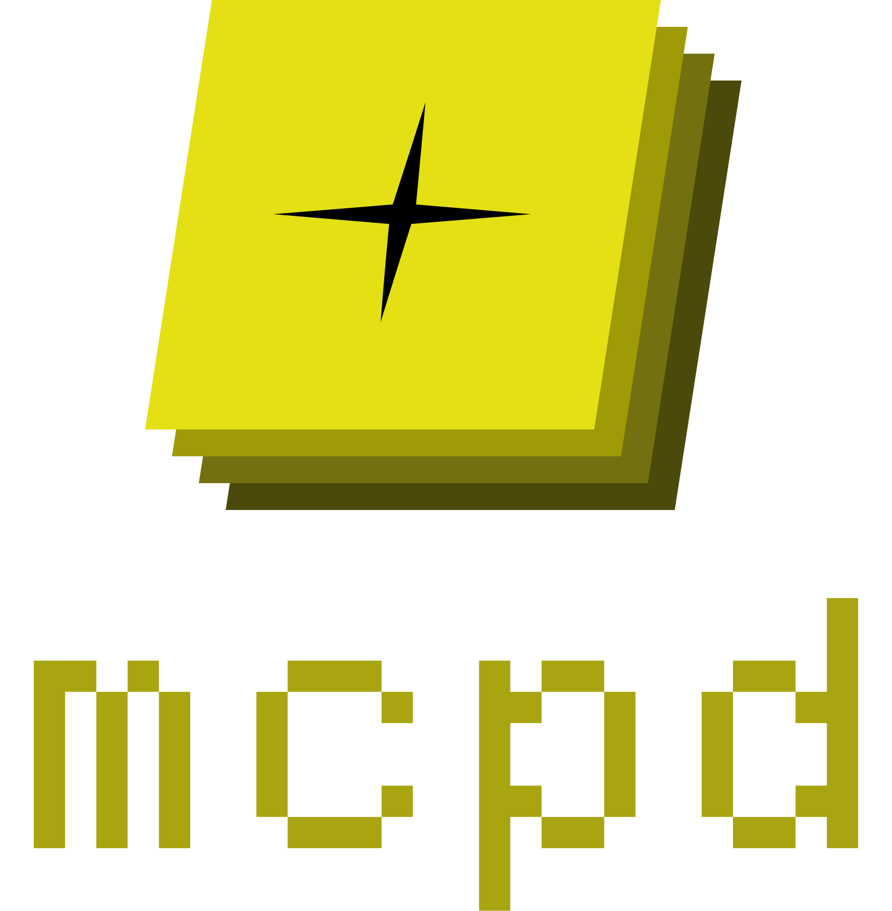

# <span class="logo-text">mcpd</span> {: .logo-image}

> *Run your agents, not your infrastructure.*

---

`mcpd` is a toolchain and runtime developed by [Mozilla AI](https://mozilla.ai) that simplifies the configuration, 
execution and integration of [Model Context Protocol](https://modelcontextprotocol.io/overview) (MCP) servers with your agentic application.
It is intended to provide the same experience across local, development and production environments.

It removes the friction of cross-language server orchestration, secrets management, version pinning, and lifecycle control.

---

## Why `mcpd`?

Traditional agent frameworks often embed complex subprocess logic, brittle startup scripts, and ad-hoc 'desktop style' config. 

`mcpd` replaces this with:

**Zero-Config Tool Setup**  
  No cloning repos or installing language-specific dependencies. `mcpd add` and `mcpd daemon` handle everything.

**Language-Agnostic Tooling**  
  Use MCP servers written in Python (`uvx`), JavaScript/TypeScript (`npx`) in your code via a HTTP REST API that supports routing to MCP Servers.

**Declarative Tool Management**  
  Define version-pinned MCP servers and tools in `.mcpd.toml`. Reproducible, consistent, and CI-friendly.

**Project config separated from runtime variables**  
  Exportable args and environment variables per server e.g. `~/.config/mcpd/secrets.dev.toml`. 
Never commit dev specific vars to Git again.

**Unified Dev Experience**  
  One command: `mcpd daemon`. Starts and manages all servers behind the scenes.

**Intuitive SDK Integration**  
  The Python `mcpd_sdk` makes calling tools feel like native function calls; no HTTP, STDIO, or SSE boilerplate.
  Even easier for users of [any-agent](https://github.com/mozilla-ai/any-agent) via `.agent_tools()`.

**Seamless Local-to-Prod Transition**  
  The same `.mcpd.toml` and agent code work in dev, CI, and cloud environments without modification.

---

## Built for Dev & Infra

| Feature                                                          | Dev Workflow                       | Production Benefit                          |
|------------------------------------------------------------------|------------------------------------|---------------------------------------------|
| `.mcpd.toml`                                                     | Version-controlled agent tool spec | Declarative IaC for tools                   |
| `mcpd daemon`                                                    | Run everything locally             | Run in container alongside your agentic app |
| `mcpd config export`                                             | Discover required vars             | Populate CI/CD pipelines                    |
| Secure secrets store                                             | Local overrides per dev            | Injected via Control Plane                  |
| Same binary                                                      | Local builds                       | Cloud deployment                            |
| [SDKs for Python](https://github.com/mozilla-ai/mcpd-sdk-python) | Iterate locally                    | Plug into prod orchestrators                |

---

## Deploy Anywhere

`mcpd` is runtime-flexible and infrastructure-agnostic:

- ⚙️ Works in any container or host with `uv` and `npx`
- ☁️ Multi-cloud ready (AWS, GCP, Azure, on-prem)
- ♻️ Low resource overhead via in-process server management

---

## 📦 Install

### Homebrew

Add the [Mozilla.ai tap](https://github.com/mozilla-ai/homebrew-tap):

```bash
brew tap mozilla-ai/tap
```

Then install `mcpd`:

```bash
brew install mcpd
```

Or install directly from the cask in a single command:

```bash
brew install --cask mozilla-ai/tap/mcpd
```

---

## 📚 Explore the Docs

Use the sidebar to explore:

- ✅ [Requirements](requirements.md)
- ⚙️ [Configuration](configuration.md)
- 🧭 [CLI Reference](commands/mcpd.md)
- 🧵 [Execution context and secrets](execution-context.md)
- 🛠️ [Makefile and tooling](makefile.md)
- 📚 [Tutorial](tutorial.md)

---

## <span></span> About Mozilla.ai

This project is built and maintained by [Mozilla.ai](https://mozilla.ai), a mission-driven organization reimagining AI for the public good.

Have ideas or feedback? Contributions welcome via [GitHub](https://github.com/mozilla-ai/mcpd).